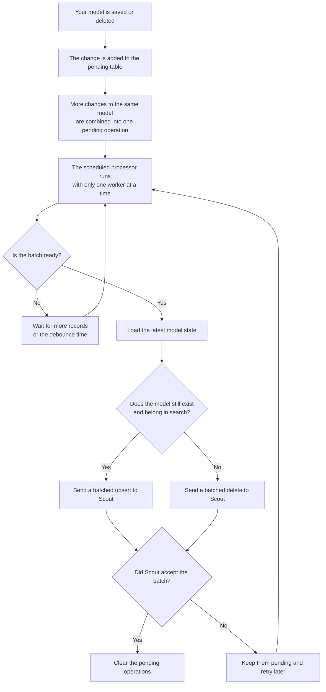

# Laravel Scout Batcher

Database-backed, search-driver-agnostic batching for Laravel Scout.

Scout normally observes each saved or deleted model and immediately performs or queues a corresponding search operation. That can create many small requests to engines that are more efficient with large batches. For example, [Meilisearch recommends sending documents in bulk](https://www.meilisearch.com/docs/capabilities/indexing/how_to/add_and_update_documents) because it handles large batches efficiently and processes each batch as one task.

This package retains Scout's observer and engine APIs, but replaces its queued collection methods with a transactional database outbox. A pending group is processed when **either**:

- it reaches `max_batch_size`; or
- its oldest operation has waited `debounce_seconds`.

The latest operation for each model wins.

## Compatibility

- PHP 8.1+
- Laravel 10, 11, 12, or 13
- Laravel Scout 10 or 11
- Any Scout engine implementing the standard `update` and `delete` methods

No Redis service is required.

## Installation

This package is published on Packagist as `jonhassall/laravel-scout-batcher`.

```bash
composer require jonhassall/laravel-scout-batcher
php artisan vendor:publish --tag=scout-batcher-config
php artisan migrate
```

Replace Scout's trait on each batched model:

```php
use Illuminate\Database\Eloquent\Model;
use JonHassall\ScoutBatcher\Concerns\BatchSearchable;

class Product extends Model
{
    use BatchSearchable;
}
```

Do not use `Laravel\Scout\Searchable` alongside `BatchSearchable`; the latter already includes it.

## Configuration

Every option in [`config/scout-batcher.php`](config/scout-batcher.php) can be configured through the corresponding environment variable:

| Setting | Environment variable | Default | Description |
| --- | --- | ---: | --- |
| `enabled` | `SCOUT_BATCHER_ENABLED` | `true` | Enables batching. When disabled, models use Scout's normal queueing behavior. |
| `connection` | `SCOUT_BATCHER_DB_CONNECTION` | `null` | Database connection containing the pending-operation table. `null` uses the application's default connection. |
| `table` | `SCOUT_BATCHER_TABLE` | `scout_batcher_pending` | Name of the pending-operation table. |
| `debounce_seconds` | `SCOUT_BATCHER_SECONDS` | `5` | Maximum time an under-sized batch waits before becoming eligible. |
| `max_batch_size` | `SCOUT_BATCHER_BATCH_SIZE` | `1000` | Number of compatible records sent to Scout in one batch. A full batch becomes eligible immediately. |
| `enqueue_chunk_size` | `SCOUT_BATCHER_ENQUEUE_CHUNK` | `100` | Number of pending rows written in each database upsert. |
| `max_batches_per_run` | `SCOUT_BATCHER_MAX_BATCHES` | `50` | Maximum batches processed by one command invocation. Use `0` for no limit. |
| `lock_store` | `SCOUT_BATCHER_LOCK_STORE` | `null` | Laravel cache store used for the singleton process lock. `null` uses the default cache store. |
| `lock_seconds` | `SCOUT_BATCHER_LOCK_SECONDS` | `3600` | Lifetime of the singleton process lock; it should exceed the longest expected run. |
| `claim_ttl_seconds` | `SCOUT_BATCHER_CLAIM_TTL` | `300` | Time after which an abandoned database claim may be recovered. |
| `retry_after_seconds` | `SCOUT_BATCHER_RETRY_AFTER` | `30` | Delay before retrying a failed batch. |
| `schedule.enabled` | `SCOUT_BATCHER_SCHEDULE_ENABLED` | `true` | Registers the package's automatic Laravel schedule. Disable it to define your own schedule. |
| `schedule.poll_seconds` | `SCOUT_BATCHER_POLL_SECONDS` | `300` | How often the scheduler checks for eligible work; the default is every five minutes. |

`schedule.poll_seconds` accepts whole-minute intervals expressed in seconds. Laravel's supported sub-minute values (`1`, `2`, `5`, `10`, `15`, `20`, or `30`) are also available; other values below one minute fall back to once per minute.

## Scheduler

The package registers this command with Laravel's scheduler automatically:

```bash
php artisan scout-batcher:process
```

For local development, Laravel's persistent scheduler is convenient:

```bash
php artisan schedule:work
```

To register the schedule yourself, disable `schedule.enabled` and add:

```php
use Illuminate\Support\Facades\Schedule;

Schedule::command('scout-batcher:process')
    ->everyFiveMinutes()
    ->withoutOverlapping()
    ->onOneServer();
```

The package schedule uses `withoutOverlapping()` and `onOneServer()`. The command also acquires its own atomic lock, so scheduled and manual invocations cannot process concurrently. Set `lock_store` when the application's default cache is not shared by every application server. `lock_seconds` must be longer than the longest expected process run. Laravel can poll as often as once per second if your application needs sub-minute processing.

## Manual operation

Process all currently pending rows, including under-sized rows whose debounce window has not elapsed:

```bash
php artisan scout-batcher:process --force
```

Limit the number of batches processed in one invocation:

```bash
php artisan scout-batcher:process --max-batches=10
```

## Bypassing batching

The normal Scout synchronous methods bypass the outbox:

```php
$product->searchableSync();
$product->unsearchableSync();
```

The normal methods are debounced:

```php
$product->searchable();
$product->unsearchable();
```

Disabling `scout-batcher.enabled` makes the trait delegate to Scout's original queueing behavior.

## Retries and failures

Failed batches remain pending and are retried after `retry_after_seconds`. The pending table records the attempt count and latest error for inspection.

## Operational note

When the outbox uses a different database connection from a model, enable Scout's `after_commit` option so rolled-back model transactions cannot leave pending rows behind.

The package reduces application-to-engine request count, but some engines acknowledge a batch asynchronously. Successful processing means the Scout engine accepted the request, not necessarily that the remote index has finished processing it.

## Events

The package dispatches:

- `JonHassall\ScoutBatcher\Events\ScoutBatchProcessed`
- `JonHassall\ScoutBatcher\Events\ScoutBatchFailed`

## How it works



## Testing

```bash
composer install
composer test
```

## License

MIT
